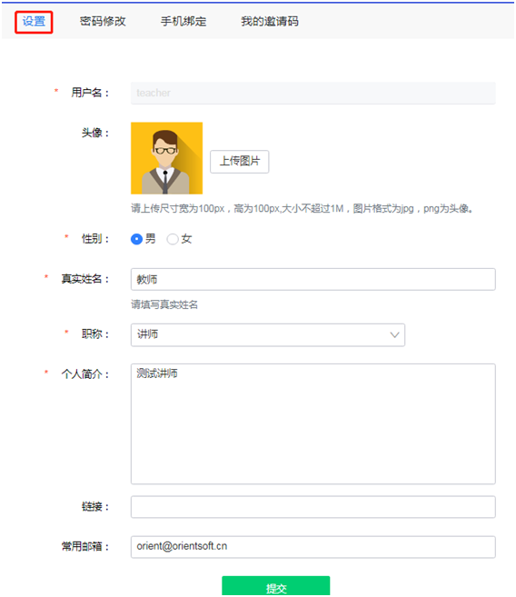
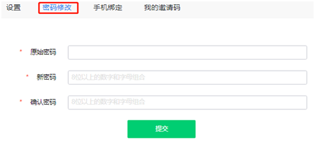
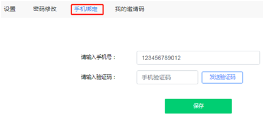
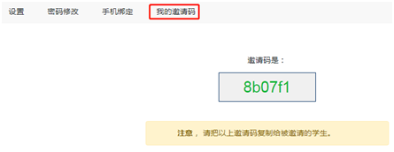

## 老师个人信息设置

首页点击右上角人像图标选择“设置”，老师在设置页面可填写个人信息，修改本人登录密码，绑定手机号码，获取本人邀请码（用于学生注册）。

***Step1*** 	设置-老师个人信息：将在课程信息中展现

***Step2***	设置-密码修改：

 

***Step3***	设置-手机绑定：用于老师登录密码找回时的手机验证

 

***Step4***	设置-我的邀请码：获取本人邀请码，用于学生注册

