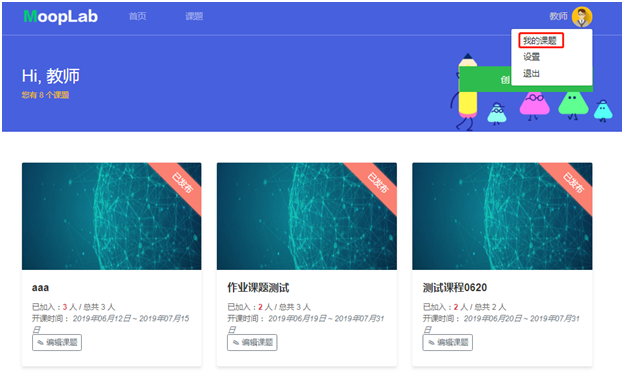
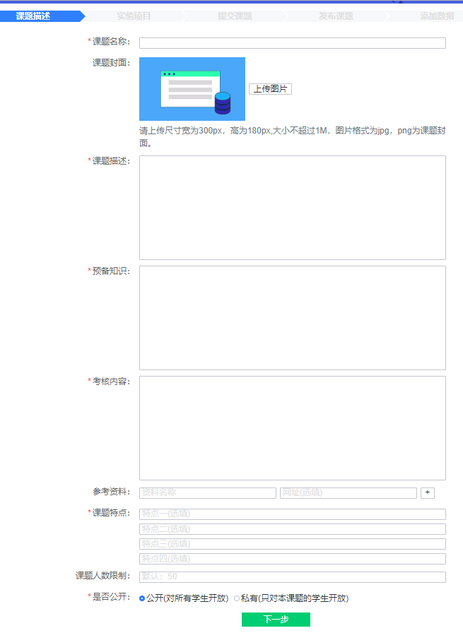
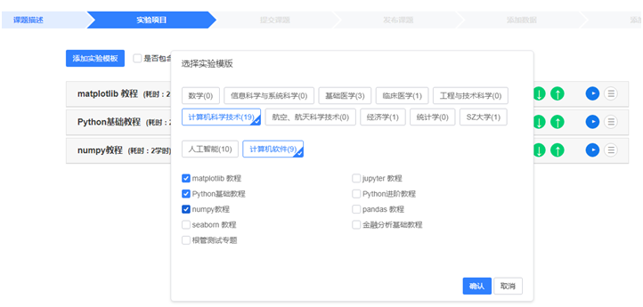
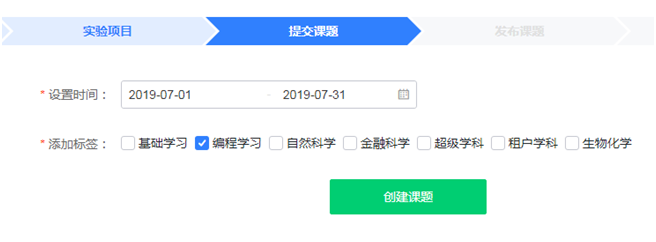
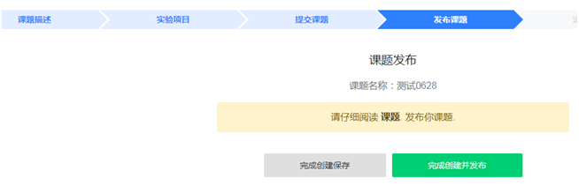
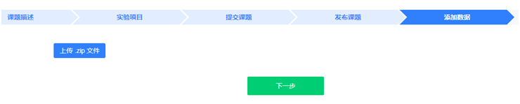
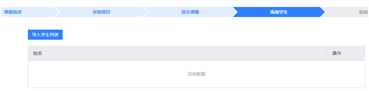

## 老师创建新课题发布课程

老师首页点击右上角人像图标选择“我的课题”，展示该老师名下所有课题。

 

​          ***Step1***       创建课题信息（老师填写信息，包括：课题名称、课题描述、预备知识、考核内容、参考资料、课题特点、课题人数限制、公开/私有等。）

​                   

​          ***Step2***       组合实验项目（添加实验模板）

​                 

​          ***Step3***       设置起止时间和标签

​                   

 

​          ***Step4***       发布课题/仅保存暂不发布

> 注意：未发布课程可以删除，已发布课程不能删除。

​                            

​          ***Step5***       添加数据（上传数据ZIP文件）                   

 

​          ***Step6***       私有课程时，老师上传学生名单（MOOPLAB学生登陆名），邀请指定学生加入课程。公有课程无需此步骤。

> 注意：
>
> - 课程分为私有课程和公有课程；
> - 公有课程学生无需老师邀请可自行加入；
> - 私有课程学生不可主动加入，需要老师邀请（上传学生名单）。

​         

​          ***Step7***       至此，该课程就已完成发布。

​                   

------

 

## 老师编辑原有课程

> - 未发布课程可重新编辑全部信息后发布，操作步骤与新建课程相同；
>
> - 已发布课程中实验项目、起止时间、标签不可更改；
>
> - 已发布课程超过截止日期后就已结束，课程列表中不可见，保留在学生-我的课题中，供学生复习使用。