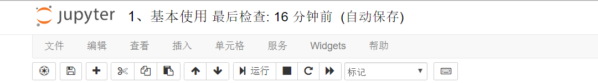

# MoopLab用户手册

## 1. MOOP & MOOPLab

> Massive Online Open Program - MOOP，大规模在线开放编程
> MoopLab - 数据科学开放实验室

### 1.0 Jupyter与MOOPLab

> [Jupyter项目](jupyter.org)是一个非盈利的开源项目，继承了2014年的[IPython开源项目](https://ipython.org)，其目标是提供交互式的多语言数据科学和科学计算环境。Jupyter是100%完全开源免费的，使用者需要根据[修改后的BSD许可证的自由条款](https://opensource.org/licenses/BSD-3-Clause)而进行使用。

如果每个数据科学家都应该使用或必须使用一种工具，毫无疑问，它就是Jupyter Notebook（曾用名iPython Notebook）。Jupyter Notebook是一个交互式笔记本，它功能强大，支持40多种编程语言，可共享，并提供在同一环境中构建可视化应用的服务。

数据科学家可以在上面创建和共享自己的文档，从实现代码到全面报告，Jupyter Notebook大大简化了开发者的工作流程，帮助他们实现更高的生产力和更简单的多人协作。也正是因为如此，它一直以来都是数据科学家们最喜欢的工具之一。

MOOPLab是由[Jupyter China](jupyterchina.org)

### 1.1 MOOP的竞争力

​    现在网络上有很多各种各样的平台，他们各有各自的面向对象。

- 程序员社区，比如CSDN，博客园，核心是博客，资源共享困难，而版权问题严重，作为一个程序员社区却缺乏良好的编程环境。
- 大数据竞赛平台，比如kaggle，阿里天池，核心是数据竞赛，干货很足，内容分享和自主创作上稍显欠缺。
- 分析平台，比如优矿，有良好的数据和API，也有了丰富的内容，但是API不共享，局限在平台上，主题局限于金融量化分析。
- 教学平台，比如中国大学MOOC，网易公开课，内容丰富，但是只有视频，学习者无法进行练习，也无法互相分享内容。
- 程序托管仓库，比如GitHub，只作为开源代码的托管仓库，没有多余的服务。
- 编程平台，比如leetcode，只作为在线编程平台，主要强调算法等计算机基础知识，没有和各行各业的交叉内容。

​    这些问题，MOOP平台没有全部克服，同样也有很多不足，但是给出了自己的解决方案。

1. **MOOP为用户提供了创作和分享的平台。**

    MOOP鼓励用户进行内容的创作并贡献出来，创建自己的课题，并学习别人的课题，在课题之下进行讨论。

2. **MOOP为用户提供了编程的环境。**

    避免了用户硬件上的匮乏，而每个人都能使用到一样好的计算资源。

    遗憾的是，平台目前只能支持Jupyter提供的环境。

3. **MOOP提供可定制的内容。**

    得益于Jupyter Notebook的服务，MOOP可以整合notebook到一起，形成一个课题式的学习内容。用户只需要将内容整理好，然后按照MOOP的指引进行上传。所有的内容都是用户自己定制的，主题可以是leetcode那样的算法，也可以是优矿那样的金融量化分析，甚至可以没有程序，只有文字。

4. **内容可移植。**

    MOOP上的内容都是ipynb格式存在的，并且托管在GitHub上，你可以很方便地在GitHub上下载这个资源，并获取依赖，从而在自己的电脑或是任何想要的地方运行。同样，你也可以将ipynb文件转化成python文件。

​    一句话来说，就是**MOOP是一个云平台，提供了编程和交流的环境，并有相当的自定义空间**。

​    一个平台，难免要在灵活性，专业性，便捷程度等方面进行权衡。或许没有leetcode那样的用例测试，全语言支持，没有MOOC那样的丰富的视频资源，没有kaggle那样丰厚的奖金和挑战，也没有优矿那样丰富的数据和API。但是这并不妨碍MOOP成为一个有优秀的平台，因为我们有自己的竞争力。

​    这些优点具体化来说，就是，你可以在这个平台自由地选择感兴趣的主题，按照作者的思路进行实践，可以直接打开浏览器，在平台上进行实践，也可以将内容下载下来，在本地进行实践，从而获取这个方面的知识。进一步地，对多个内容学习后，会产生自己的一些思考和想法，这时候你就可以很方便地进行自己的实验，然后整理成一份新的notebook，构建自己的仓库和镜像，发布在社区中，和大家一起来探讨，共同进步。

### 1.2 MOOP VS Jupyter

​    为什么要选择MOOP而不直接使用Jupyter呢？我们有下面的几个理由。

​    有三种方式可以使用Jupyter Notebook：

1. 本地安装

    在自己的电脑或者是机房电脑上安装。好处是性能自己定义，坏处是需要自己安装和配置，这对于非专业的人员来说可能并不简单。

2. 服务器安装

    如果需要多人使用，那么在服务器上安装肯定比在机房中安装要好，因为可以避免离开机房无法访问的情况。假设这是课堂教学的场景，在服务器上安装Jupyter免除了学生的烦恼，但是增加了教师或者是维护人员的工作负担，很多情况下，非专业的教师是并不懂怎么在服务器上安装Jupyter的。并且如果是学生比较多的情况下，维持这样一个服务器需要的费用并不小。

3. 云平台

    市场上有很多将Jupyter云端化的平台，比如上面提到的Kaggle和我们的MOOP平台。这种情况下，内容提供者便无需为工具而发愁，专心致志地完成内容。而学习者也可以得到统一的，性能足够的服务。这避免了用户的硬件资源的匮乏，只需要能上网的电脑，便可以胜任。

​    除了云的优势之外，作为一个内容平台，MOOP还提供了很多公有的资源，每个人都可以在MOOP上学习和分享自己的知识见解，这种社区的作用是Jupyter无法提供的。

​    借助于GitHub，MOOP可以提供更方便的定制内容，只需要在GitHub上规定好镜像，MOOP便可以帮你做好剩下的事情。而Jupyter无法对版本进行控制，也不能帮你装好一个定制的镜像，容易造成编程环境的污染。

​    总而言之，如果你想组织自己的材料成为网络上课堂，如果你想获取足够的计算性能，并在任何计算机上都可以随时访问这些材料，如果不想自己去安装配置服务，如果想和别人进行交流，如果想快速地获取大量的免费notebook资源，那就使用MOOP吧！

### 1.3 MOOP的使用方法

​    MOOP平台使用方法实际上很简单，上手尝试几分钟就可以熟悉。但是如果理清背后的逻辑，知道互相之间的区别，会对MOOP平台的使用方法更加胸有成竹。如果你想更多了解，请看下面的内容。

#### 课题

​    MOOP建议围绕一个主题来组织内容，称之为一个课题，比如“量化金融分析”，“Python爬虫实战”。创建一个新的课题，需要以下的信息。

1. 课题本身的信息

    名称，图片，课题的描述，考核内容，课题特点和参考资料

2. 课题的学习内容

    要学习课题必须的先修知识，包含的实验

3. 课题的属性

    发布时间和标签：可以选择定时发布，然后贴上一些领域的标签。

4. 课题的权限

    是否公开，如果不公开需要添加学生，一个私有的课题，那么赋予某一部分人访问的权限是很有必要的。通过直接上传一个csv或者是excel表格，MOOP会自动地查找到这些学生，然后赋予他们访问权限。

5. 数据

    对于数据相关的课题，实验的流程都是相同的，但是数据的不同就有不同的分析结果，所以MOOP专门提供了上传自己的数据的地方。

​    在每个课题被发布后，如果有任何不满意的地方，都可以再次编辑，不用担心一次做不好的情况。在课题页面，老师还可以对学生的学习进度进行观察和评估。

​    对于学生而言，和老师看到的内容是不一样的。除了上面提到的实验内容，课题描述，先修知识，考核内容，课题特点和参考，学生在课题页面再没有多余的信息。也就是说，学生就只能进行学习，而老师不仅可以管理课题，还可以管理学生。

#### 实验

​    每个课题下都有数个实验，每次实验有几个部分(也就是几个notebook)，如果内容不算多，那么一个实验就足够了，就好像一本书的章节一样。 想象一个编程的新手，要学习Python，在“Python入门”课题中，可能会学习下面的知识：

> Python入门课题
>   1.  Python基础教程
>       1.  Python简介
>       2.  第一个Python程序：Hello World
>       3.  语法
>       4.  函数
>   2.  Python高级教程
>       1.  正则表达式
>       2.  爬虫
>       3.  文件操作

​    实验是管理编程环境和文件的基本单位。每个一实验的编程环境是一样的，即有同样的Python packages，实验下面的每一个内容都是一个Jupyter notebook。此外，每个实验下需要单独配备notebook需要的数据，存放在notebook的同级文件夹下。在页面上，实验有一个的耗时估计，由创建者填写，一般建议一个实验不超过4小时。

​    MOOP自带了很多实验模板，同时老师也可以自己创建实验。比较遗憾的是，目前MOOP无法做到自主创建实验，而是要老师联系管理员，将实验，也就是notebooks递交给内容建设员，让内容建设员来创建实验，创建好后，老师再在课题页面拉取想要的实验。

#### 角色

​    MOOP按照权限不同，有以下5级权限。

0. ADMIN/系统管理员

    整个系统的最高权限者，是MOOP平台的内部指定的开发者

1. CONTRIBUTOR/内容建设员

    可以创建新的实验到MOOP平台中，供大家使用

2. SUPER/超级管理员

    可以赋予普通用户各种权限，控制３，4级的任意角色权限分配，但是本身并不能创建新的实验

3. TEACHER/教师

    可以选择实验来创建新的课题，供教学使用

4. STUDENT/学生

     最低权限者，可以浏览并学习各种课题

​    其中，２，3，4处于一个系统管理之下，叫做`tenant/租户`。

​    下面用现实场景来解释一下这个体系：一个学校为一个单位，即租户，这个租户中有少量的管理员，和大量的老师学生。管理员可以直接跟MOOP平台联系，获得技术支持，并管理这个租户内的全部账户，但是并不能创建新的内容。一般而言，具有一定的专业知识的管理员都可以申请成为CONTRIBUTOR。而学校里的教师，可以从管理员处获得老师账户，可以创建新的课题，当老师写了一些新的notebook，可以联系CONTRIBUTOR来创建新的实验，然后用到自己的课题之中。这些实验一般在一个租户下是公用的，也就是说，同校的教师和学生是共享这些实验内容的，大家都可以互相使用对方的实验来组成自己的课题。而不同校的实验内容，可以看到，但是就不一定能访问。学生就只能学习由老师创建的课题，其他没有任何权限。

​    在学校体系(租户体系)和MOOP管理远之外有一个特殊的权限角色，叫做`CONTRIBUTOR/内容建设员`，这个角色只能上传新的实验到MOOP平台上，其他没有任何权限。设定这个特殊权限的原因在于，目前MOOP平台创建实验牵涉到镜像的修建，这不仅仅是提交一些notebook就可以的，而是需要一些特殊的设定和文件，虽然并不困难，但是MOOP还是将这个任务交给了一少部分人，从而让大部分的教师都从不必要的操作上解脱。MOOP平台提供这方面的支持，随时都有人来准备创建新的实验，同时鼓励学校中的SUPER学习如何创建实验，来更快速地响应各位老师的需求。

#### 开始使用

​    上面的介绍还只是对MOOP管理的一个理解，下面对MOOP真正的使用进行介绍。

1. 注册

2. 进入课题

   选择顶栏的“课题”就可以进入课题的选择，这些五花八门的课题是按照标签来分类的，比如“基础学习”，“编程学习”等等。每个标签下面有数个课题可以选择

3. 开始编程

   在课题浏览页面，可以看到一个课题下面的一些实验，点击启动按钮再等待一段时间便可以启动任意的一个实验。由于实验与实验之间的环境是隔离开的，所以不同的实验需要重新启动新的环境。每次启动大约需要10s，相当于是电脑重新开机的时间。

   启动后，点击实验下的任意notebook会跳转到一个新的界面，就是Jupyter Notebook的界面，在这里，你的使用就和以前的使用完全一样了。如果你并没有使用过，可以看一下[第二节](#21-jupyter-notebook介绍)的对Jupyter的介绍。

   注意一个账户同一时间只能启动一个实验，这是出于服务器资源有限的考虑。如果要启动另一个实验，必须关闭之前的实验。并且，一个实验最多持续半小时，时间快到了会提示。未来我们会进行改进，让你可以不用重新开启实验，并且做的过程中就可以直观地看到时间流逝而不是被动提示。

4. 管理自己的信息

   在右上角的头像处，可以查看已修课题，也可以修改自己的个人信息。

### 1.4 MOOP的板块体系

​    各行各业都可以在MOOP上找到自己的领域，和有共同兴趣的人们进行交流或者是独自探索。现在MOOP平台有以下的一些领域。目前每个课程都只能关联二级分类，而不能直接和一级分类关联。随着平台的发展，将来这个体系会逐渐地成长，更加丰富，更加细致。

>   1.  数学
>       1.  数理逻辑与数学基础
>       2.  数学分析
>       3.  计算机数学
>       4.  概率论
>       5.  应用数学
>   2.  信息科学与系统科学
>       1.  信息科学与系统科学基础学科
>       2.  系统工程方法论
>       3.  控制理论
>   3.  基础医学
>       1.  医学生物化学
>       2.  医学实验动物学
>   4.  临床医学
>   5.  工程与技术科学
>   6.  计算机科学技术
>       1.  人工智能
>       2.  计算机软件
>   7.  航空、航天科学技术
>   8.  经济学
>       1.  金融学
>       2.  信息经济学
>   9.  统计学

​    在计算机迅猛发展的今天，计算机算力的提高让很多行业都迎来了新的前景，比如人工智能和量化金融分析，这在十多年前，由于计算机能力的有限，无法得到发展，而今天都成为了各自领域的热门研究对象。不仅仅是他们，包括医学，数学等学科都与计算机有了更加紧密的联系。使用MOOP，在专业化的平台上获取云计算资源，达到想要的目标。

## 2. MOOP学习者

​    MOOP建立于Jupyter Notebook之上，用好Jupyter Notebook对于利用MOOP平台进行学习的意义非同寻常。下面会介绍很多如何使用Jupyter Notebook的方法。

### 2.1 Jupyter Notebook介绍

​    Jupyter Notebook是Jupyter项目的一部分，可以用来创建一个Jupyter专用的notebook，而这个notebook是集成了可执行代码，公式，文档，可视化内容的一份文件。notebook允许用户将数据，代码，文字结合到一起，不失表达能力地，展现一个可交互性的，可计算的内容。

​    Jupyter是一个开源的免费平台，基于网页，并有以下的一些特点：

1. Notebook可直接通过浏览器运行代码，同时在代码块下方展示运行结果。
2. Notebook对代码编写说明文档或语句时，支持Markdown语法。
3. notebook支持使用LaTeX编写数学性说明。
4. Jupyter支持超过40种编程语言包括Python，R，Julia和Scala。
5. Notebook可以通过github，DropBox和Jupyter Notebook Viewer进行非常方便的分享。
6. 可以生成丰富的交互式输出：HTML，图像，视频，Latex和其它自定义类型。
7. 利用Python、R，和Scala等工具，与Spark、pandas、scikit-learn、ggplot2、TensorFlow等集成。
8. notebook中也可运行shell命令。
9. 可运行terminal和console窗口。
10. 文档管理方便。

​    目前Python语言在Jupyter的使用中占据了绝对的比例，而Python脚本语言的特性，在Jupyter Notebook中得到了非常好的发挥。Notebook中的基本单位是cell，可以写入代码，也可以写入纯文本，还可以写入markdown，运行一个cell，即可运行其中的代码，或者是将markdown cell转化成预览格式。一个cell运行完了会在cell下方进行输出，这跟Python console是一模一样的，而notebook中的内容是可以持久储存的，这又是py文件的优点。

### 2.2 键盘操作

​    在使用键盘的过程中，使用快捷键可以节约时间和操作，比如非常常见的ctrl+c和ctrl+v，如果用鼠标的复制粘贴，那效率对比真的是显著。

​    在notebook编辑界面中，选择“帮助-快捷键”或者是"Help-Keyboard Shortcuts"可以查看全部快捷键。下面简单介绍一些Jupyter的常见键盘操作。

#### 通用

| 快捷键          | 含义 | 快捷键 | 含义 |
| --------------- | ---- | ------ | ---- |
| Shift-Enter | 运行代码块, 选择下面的代码块 | Ctrl-Enter       | 运行选中的代码块 |
| Ctrl-S      | 保存并检查                   | Ctrl-Shift-Minus | 在鼠标处分割cell |

#### 命令行模式(按 Esc 生效)

| 快捷键          | 含义 | 快捷键 | 含义 |
| --------------- | ---- | ------ | ---- |
| F  | 查找并且替换 |    Y    | 把cell变成代码块 |
| M | 把cell变成文本块 | R | 清除cell格式 |
| A | 在上面插入代码块 | B | 在下面插入代码块 |
| X | 剪切选择的代码块 | C | 复制选择的代码块 |
| V | 粘贴到下面 | D,D | 删除选中单元格 |

#### 编辑模式(按 Enter 生效)

| 快捷键          | 含义 | 快捷键 | 含义 |
| --------------- | ---- | ------ | ---- |
| Tab | 代码完成或缩进 |    Ctrl-A    | 全选 |
| Ctrl-Z | 撤销 | Ctrl-/ | 注释 |
| Ctrl-D | 删除整行 |  |  |

### 2.3 插件系统

​    [这个项目](<https://github.com/ipython-contrib/jupyter_contrib_nbextensions>)为Jupyter Notebook提供了插件系统，虽然是非官方的，但是非常好用。Jupyter Lab由于框架不同，并且处于快速迭代中，因此并不被支持。使用`conda install -c conda-forge jupyter_contrib_nbextensions`就可以下载。同样，他们提供了不同插件的[使用方法](<https://jupyter-contrib-nbextensions.readthedocs.io/en/latest/>)。

​    在终端执行`jupyter nbextension enable toc2/main`可以激活toc2插件，或者可以在主目录的图形环境下手动勾选要激活什么环境。注意激活的时候格式是`extension/main`。

​    下面介绍几个比较常用的插件。

1.  Table of content

    ​    一本书没有目录是无法接受的，同样，如果notebook没有目录，不管使用者还是写作者都会感受到不安和焦虑，并且为了保证逻辑性，方便搜查，没有快捷的跳转方式会将notebook的规模限制到很短的篇幅。

    ​    这个TOC插件就可以解决这个问题，他可以搜集notebook中markdown的部分，并且为#标记的各级标题生成目录结构。这个目录支持随时跳转，可以固定在边上，也可以移动成为悬浮框。

    

2.  Collapsible headings

    ​    可折叠的标题，同样是为了更好地浏览，让人有全局观的一个插件，可以把某个标题下的代码块全部折叠起来。

3.  Autopep8

    ​    规范的代码风格可以让人更轻松地阅读，所以python代码都应该支持最新的pep8标准。这个插件可以一键完成代码风格转换，让你可以安心写代码，写完了再修复哪些看起来不好看的瑕疵。毕竟代码的逻辑和完成度远比美观度重要。

4.  Variable Inspector

    ​    用IDE的同学会用到一个功能叫做调试，目的就是一步一步执行代码，并观察变量值的变化。而Jupyter本身就自带了分步执行的特性，观察变量也只需要写变量名再执行即可。但是这还可以更方便，使用这个Variable Inspector插件，可以产生一个悬浮窗，里面包含了所有的变量的基本属性，可以到处移动和最小化，非常方便。

    

5.  ExecuteTime

    ​    这个插件会记录某一个cell运行的时长和完成时间，对于性能分析和好奇的同学非常有帮助。

6.  Codefolding

    ​    如果代码中有类或者函数这种封装好的代码，我们一般是不想去看里面的内容的，这时候如果能把他们的内容折叠起来，整体代码就会显得清爽整洁，这个Codefolding插件就是实现这样的功能。

7.  zenmode

    ​    通常我们会觉得代码编辑区越大越好，然而Jupyter的“刘海”直接占据了大量的屏幕空间，zenmode即禅模式，可以在Nbextensions下进行配置，隐藏header和菜单栏，甚至是自定义隐藏内容。

    

    ​    打开禅模式后，就会像下图一样，隐藏三行，剩下一行，并且透明度会变高。因为header只有显示名字和重命名的功能，而菜单栏我们使用频率也很低，只要掌握了常用的快捷键，使用zenmode将会提高使用Jupyter的使用感，让我们更加专注于代码本身。值得注意的是，这个插件的启动和终止是在最左边的，其他的插件一般都是在右边。

    

8.  Hinterland

    ​    Jupyter Notebook支持代码自动补全，但是需要每次按tab才会智能提示，使用Hinterland会始终激活代码补全提示。面对长长的记不住的变量名函数名，总算是不需要担心了。

9.  其他插件

    ​    nbextension提供了非常多的插件，了解这些插件并在合适的时候启用他们，将事半功倍，使得Jupyter Notebook在很多地方并不逊色，在交互性上远远超过IDE。

## 3. 对于内容发布者

### 3.1 分享者

​    一个内容平台的核心竞争力是内容本身。MOOP本身能提供的内容资源非常有限，任何一个平台都是如此，一个良好的社区是靠大家来共同维护和建造的，而不是靠社区管理员。作为一个新的内容平台，无可避免地要从无到有。就像一个黑洞，越吞越大才能更有吸引力。当实验材料足够多的时候，就可以随心所欲地组织材料，进行修改，创建你想要的课题了。

​    一个开放的平台，还是需要亮点来吸引人们聚集。而MOOP平台的亮点就在于，提供了统一的云平台进行编程和内容的分享，并有相当程度的自定义空间。即，这是一个欢迎内容创作者的平台，MOOP提供了很大的空间来让创作者创建自己的课题。

​    MOOP拥抱共享开放的思想，同时尊重版权，如果有不想公开的内容，MOOP提供了课题和实验的私有选项，只供你选择的对象使用。

### 3.2 教育者

​    如果你是一个教育者，以教育为责，或许你可以看看下面的内容。合理的利用，MOOP会成为教育者的得力工具。

#### Python

​    计算机汹涌发展的时代，每个人都应该学习计算机，如果想变得更有竞争力，那学习计算机语言也是很自然的。

​    TIOBE排行榜是根据互联网上有经验的程序员、课程和第三方厂商的数量，并使用搜索引擎（如Google、Bing、Yahoo!）以及Wikipedia、Amazon、YouTube统计出排名数据，只是反映某个编程语言的热门程度。总而言之就是一个编程语言热度排行榜。而在这个榜上，

​    纵观这几年国内计算机的发展，Python的发展也很迅猛。首先是全国计算机等级考试将Python纳入考试范围，其次，是Python被纳入了北京，山东，浙江的高考内容，这两项代表了Python收到了官方的认可，注定未来的覆盖面会越来越广，使用人数越来越多。

​    而这一切的根本原因是Python语言本身的特性。相比较经典语言C，C++和Java，Python的显著特点就是简单易学，语法简单，概念简单，门槛很低。Python的难度低到了，一个普通的高中，甚至初中生，都可以很轻松地在一周内学会基础用法，在更长的时间内，学会如何使用，如何真正开始做一件有目的的事情，写一个有意义的程序。这导致编程语言不再是专业人员的工具，而是所有人的工具。以至于网络上有非常多的很棒的免费资源，来教导你如何掌握这个工具。

​    但是掌握Python的意义并不在Python语言本身，而是在“用Python做什么”。一个简单的东西并不能提供竞争力，就好比你会识数和会计算微积分的意义是完全不同的。Python的意义在于，你可以非常方便地实现你想要的东西。Python+NumPy+matplotlib可以替代matlab做科学计算，Python可以做web服务，可以做爬虫，可以做现在热门的人工智能……一切其他语言能做的，Python都能做，只是可能有运行性能等不足。但是可以肯定的是，Python一定是实现的速度最快最简单的几种方案。

​    Excel和Word等office套件为代表的计算机应用，是上一代的计算机应用，在二十年前他们拥有巨大的竞争力，而现在，他们慢慢变成了常用工具，只要用计算机的人，就跟他们有联系。现在，Python即将成为新时代的Excel，虽然不是人人都会用Excel做透视表，做筛选汇总，但是人人都会整理自己的数据生成自己的报表，同样，虽然不是人人都能用Python进行人脸识别，但是未来一定可以实现，人人都会用Python来写自己的小程序，帮助自己做一些重复性的劳动。

​    总而言之，Python的好处在哪里？足够简单，足够强大。用Python来教授你的内容，很有必要。

#### Jupyter的角色

​    [Teaching and Learning with Jupyter](<https://jupyter4edu.github.io/jupyter-edu-book/>)

​    对于一个教育者，一些事情是责无旁贷的，比如准备教案，布置作业，评估学生的进步，准备教学材料，引导学生的探索和交流，帮助养成学生的思辨能力，在恰当的时候鼓舞学生，解决学生的提问，学习如何成为更好的教育者……

​    而Jupyter的作用可以用这样的一句话来概括：

>   In short, we design learning environments and experiences.

​    Jupyter可以提供一个比较好的工具来做这些事情。由于Jupyter的交互性，我们有理由认为，学生在使用的时候，对材料的理解程度，对学习的参与度会更高，学习的效果都会更好。

​    Jupyter在教育上的作用，可以体现在下面的几个方面：

*   **教科书**：首先，notebook中的阅读材料可以作为预习或者复习的内容，也可以作为参考内容。第二，当文本和可执行代码联合到一起，传统教材的图片和文字，都变成了可以操作的内容。最后，教科书可以很方便地进行修改，并分发到学生手中，成本非常低。
*   **工作手册**：notebook最大的优点就在于可交互性。学生可以更好地理解某一步代码是在干什么，可以得到什么结论。由于代码是按cell为单位执行，所以学生在执行代码的时候，可以很方便地找到错误所在，而不需要像传统的python文件那样，要再找错误发生的地方。同时，如果在代码cell的旁边有markdown cell，可以让学生对一个比较大的问题，得到更精确的系统化的理解。
*   **笔记本**：电子的笔记本的优点就在于可以反复地修改，notebook支持学生在任何地方写下自己的思考，并且在后面的回顾时继续修改。同时，电子笔记本可以很方便地转化成各种格式，比如PDF和word文档，也可以在平台上储存，并分享给其他人。
*   **app**：对于技巧并不娴熟的学生，notebook可以作为一个应用(application)，只需要教导学生修改输入输出即可。这样学生依旧可以获得交互性的体验，比如一个绘制图表的程序，当学生修改了一个参数，图像就可以从柱状图变成折线图。如果学生有兴趣，可以进一步地自主学习。因此，即便课堂的主题并不是编程，依旧可以使用notebook。
*   **实验报告和作业**：通过notebook发布实验报告和作业，可以有更加统一的格式保证。尤其是涉及到代码和计算相关的内容，notebook显然比word文档更加美观，并且方便演示和验证。同时，notebook可以转化成其他格式的文件，也更方便适配各种上传平台。
*   **多媒体**：notebook中可以嵌入各种多媒体文件，包括了图片，音频，视频和超链接，这让内容的丰富程度大大提高了。

#### Jupyter的使用范例

​    下面我们将介绍一些Jupyter在教育方面的使用模式，每一种模式都对应了特定的教学目标和目标人群。这可能有助于启发教育者。

*   shift-enter
    1.  需求描述：当为了一个主题需要阅读的时候，阅读静态的材料是枯燥的，如果学生可以交互性地执行代码，或者是使用一些插件，那么整个过程会有趣很多。使用shift-enter可以快速地执行代码。
    2.  目标：需要阅读静态材料的学习
    3.  评估：这种模式对写作的要求比较简单，但是如果想要学习者获得足够的交互性内容，还是需要花功夫。另外，如果阅读内容较多，完成notebook的时间就会变短，交互性内容较多，则反之，这对在课堂上的notebook使用提出了一个潜在的挑战。
*   填空
    1.  需求描述：当需要对一个流程的核心部分进行学习的时候，其他的部分都并不重要。这时候核心内容可以交给学生来填空，而其他内容提前准备好。在这之后，可以通过一些手段来确保填空内容的正确性，比如绘图，测试用例，某些值的确认。
    2.  目标：对学习成果需要进行确认的学习，主次分明的内容学习
    3.  评估：这种模式增加了学生的思考内容，相当于是随堂测验，对于学生掌握学习目标和教师了解学习情况有很大的帮助。并且相对于完整的填写内容，填空可以让学生集中主要的精力，节约时间。空白的质和量决定了这个课程的难易程度。
*   修改
    1.  需求描述：有时候填空是无法满足训练需要的。为了让学生对学习任务有更好的理解，可以让学生对代码进行修改，然后得出新的结果，并进行比较。比如在机器学习算法的学习里面，轻度的修改可以是对参数的调整，中度的修改可以是对模型的修改，高度的修改可以是对算法的改变。
    2.  目标：对学习目标有更深刻的理解，将不同的学习目标进行对比
    3.  评估：学生通过少量到大量的修改，可以从不同的层次对代码背后的思想进行理解，从而在获取主体认知的基础上，了解差异性。当学生没有编程经验或者目标领域的知识的时候，也很有效果，只需要少量的编辑，带来对主体的认识。
*   app
    1.  需求描述：如果一个任务非常复杂，可以将其先视为一个app，只关注输入和输出，而忽略内部的原理。先使用，再理解。比如为通信专业的学生讲授离散傅里叶变换，传统方法要从教授复数开始，然后经过很长一段路才到达`DFT`，这一模式鼓励老师和学生先讲授总体的框架，比如给出`DFT`函数让学生使用，再去探索内部细节。
    2.  目标：学习非常复杂的内容，同时想尽快地有感性的认识
    3.  评估：这种思想在软件工程中非常常见，叫做API的思想。尤其是在学生不需要了解如何编程，只需要数学推导的情况下，这种演示材料对于直观的感受非常有用。甚至这个app的实现都不需要写在这个notebook中。
*   翻译式编程
    1.  需求描述：计算机领域困难的从来都不是如何编程，而是找到如何解决一个问题的方案，这个方案通常来说都看起来是数学问题。如果想要对目标获取深刻的理解，那么编程是一个途径。将数学公式或者一些算法用代码翻译出来，是非常有挑战性的。比如经典的斐波那契数列，动态规划，最短路径等算法。
    2.  目标：训练编程能力，深刻理解算法
    3.  评估：翻译看起来简单，但是实现过程中会有非常多的意想不到的难题，甚至无法构思出好的办法。通常，采用合适的数据结构能将问题变得简单。
*   调试训练
    1.  需求描述：调试是计算机工程师必不可少的能力，notebook的分步执行可以部分代替调试的功能。只需要提供一大段错误的代码，让学生自己找出哪里有问题。
    2.  目标：训练编程能力
    3.  评估：虽然必不可少，但是鲜有课程教授如何调试，这通常是充满经验主义的。这对教师来说很简单，但是学生却必须为了找到问题所在而苦恼。
*   用代码和公式来表达
    1.  需求描述：文字在某些时候会缺乏表达力，这时用公式或者代码可以让学习者更容易理解。
    2.  目标：更精确的表达
    3.  评估：notebook兼具文本和代码，通过联合理解，学生能更快地掌握知识。

## 4. 对于开发者

### GitHub

### Docker

### Localization
